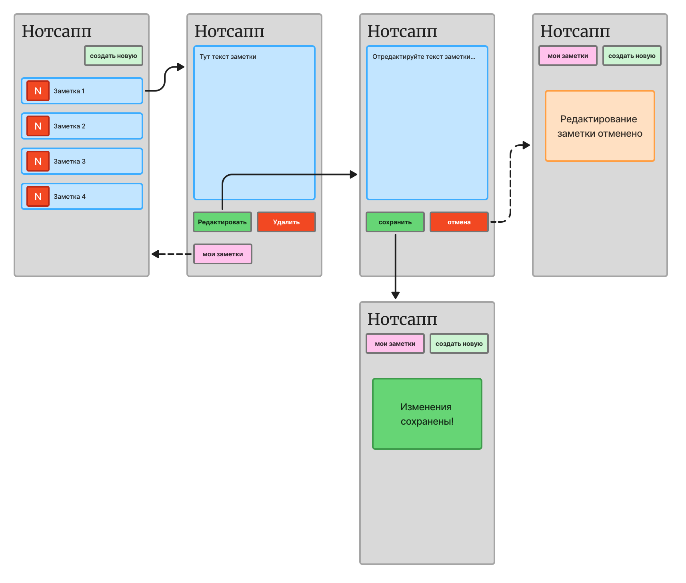

# Пользовательский сценарий "Редактирование заметки"

## Действующие лица

1. Пользователь

2. Приложение

3. Бэкенд

4. База данных

## Предварительные условия

Пользователь должен находится на главном экране.

## Выходные условия

В системе внесены изменения в выбранную заметку.

## Основной сценарий

1. Пользователь нажимает на выбранную заметку.

2. Приложение отправляет запрос бэкенду на открытие окна с формой заметки.

3. Бэкенд отправляет запрос в базу данных для вывода данных заметки на экран пользователя.

4. Бэкенд возварщает приложению данные заметки.

5. Приложение открывает пользователю информацию заметки.

6. Пользователь нажимает кнопку **Редактировать**.

7. Приложение открывает окно с формой редактирования заметки.

8. Пользователь вносит изменения в заметку.

9. Пользователь нажимает кнопку **Сохранить**.

10. Приложение отправляет запрос бэкенду на сохранение измененной заметки.

11. Бэкенд сохраняет заметку в базе данных.

12. Бэкенд возвращает приложению ответ об успешном сохранении заметки.

13. Приложение открывает пользователю уведомление «Изменения сохранены!».

## Альтернативный сценарий "Возвращение на главный экран"

1. Пользователь нажимает на выбранную заметку.

2. Приложение отправляет запрос бэкенду на открытие окна с формой заметки.

3. Бэкенд отправляет запрос в базу данных для вывода данных заметки на экран пользователя.

4. Бэкенд возварщает приложению данные заметки.

5. Приложение открывает пользователю информацию заметки.

6. Пользователь нажимает кнопку **Мои заметки**.

7. Приложение возвращает интерфейс главного экрана со всеми заметками.

## Альтернативный сценарий "Отмена сохранения"

1. Пользователь нажимает на выбранную заметку.

2. Приложение отправляет запрос бэкенду на открытие окна с формой заметки.

3. Бэкенд отправляет запрос в базу данных для вывода данных заметки на экран пользователя.

4. Бэкенд возварщает приложению данные заметки.

5. Приложение открывает пользователю информацию заметки.

6. Пользователь нажимает кнопку **Редактировать**.

7. Приложение открывает окно с формой редактирования заметки.

8. Пользователь вносит изменения в заметку.

9. Пользователь нажимает кнопку **Отмена**.

10. Приложение возвращает уведомление "Редактирование заметки отменено".

/// caption
Редактирование заметки
///
