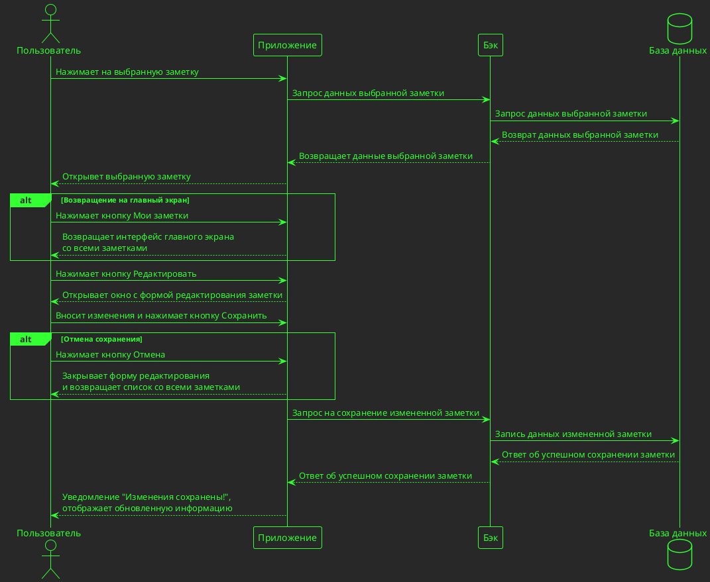

# Диаграмма пользовательского сценария "Редактирование заметки"

```puml

@startuml
!theme crt-green
actor Пользователь as user
participant Приложение as client
participant Бэк as back
database "База данных" as db

user -> client: Нажимает на выбранную заметку
client -> back: Запрос данных выбранной заметки
back -> db: Запрос данных выбранной заметки
back <-- db: Возврат данных выбранной заметки
client <-- back: Возвращает данные выбранной заметки
user <-- client: Открывет выбранную заметку
alt Возвращение на главный экран
  user -> client: Нажимает кнопку Мои заметки
  user <-- client: Возвращает интерфейс главного экрана\nсо всеми заметками
end
user -> client: Нажимает кнопку Редактировать
user <-- client: Открывает окно с формой редактирования заметки
user -> client: Вносит изменения и нажимает кнопку Сохранить
alt Отмена сохранения
  user -> client: Нажимает кнопку Отмена
  user <-- client: Закрывает форму редактирования\nи возвращает список со всеми заметками
end
client -> back: Запрос на сохранение измененной заметки
back -> db: Запись данных измененной заметки
back <-- db: Ответ об успешном сохранении заметки
client <-- back: Ответ об успешном сохранении заметки
user <-- client: Уведомление "Изменения сохранены!",\nотображает обновленную информацию

@enduml

```
